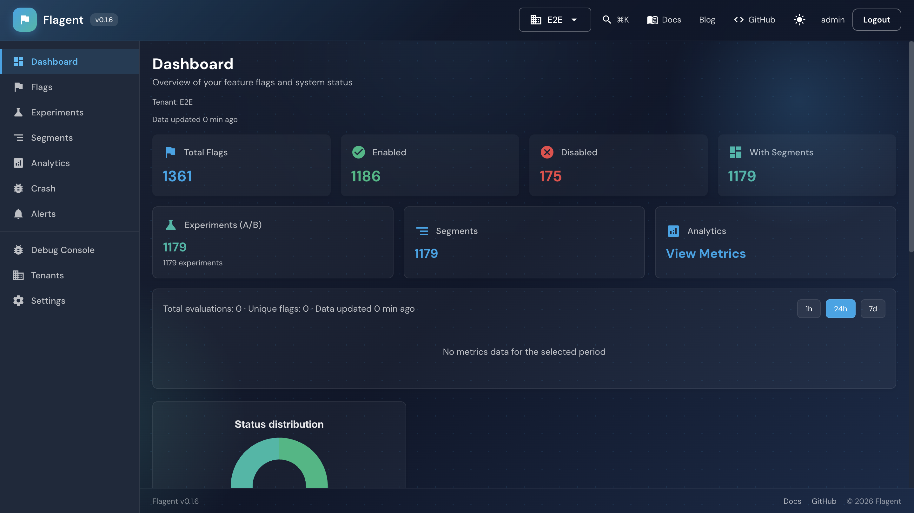
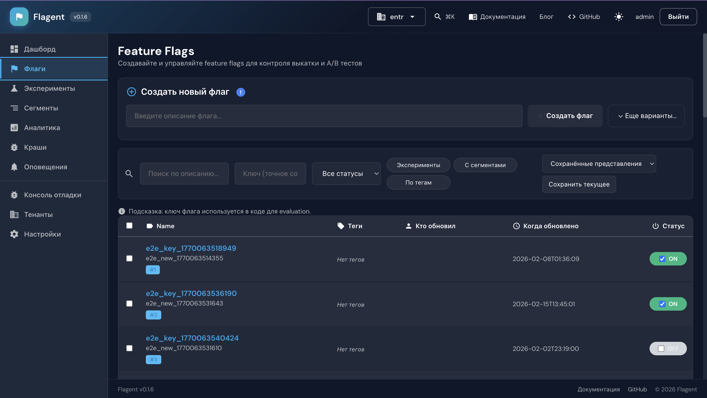
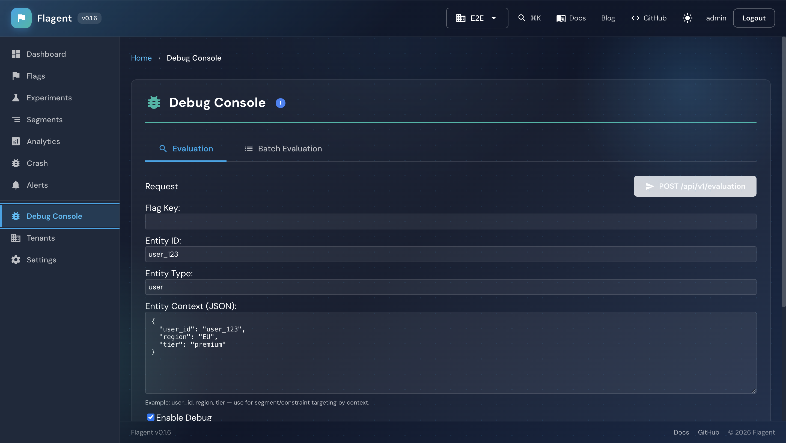
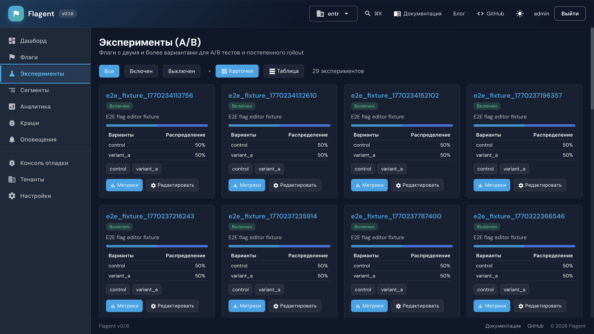
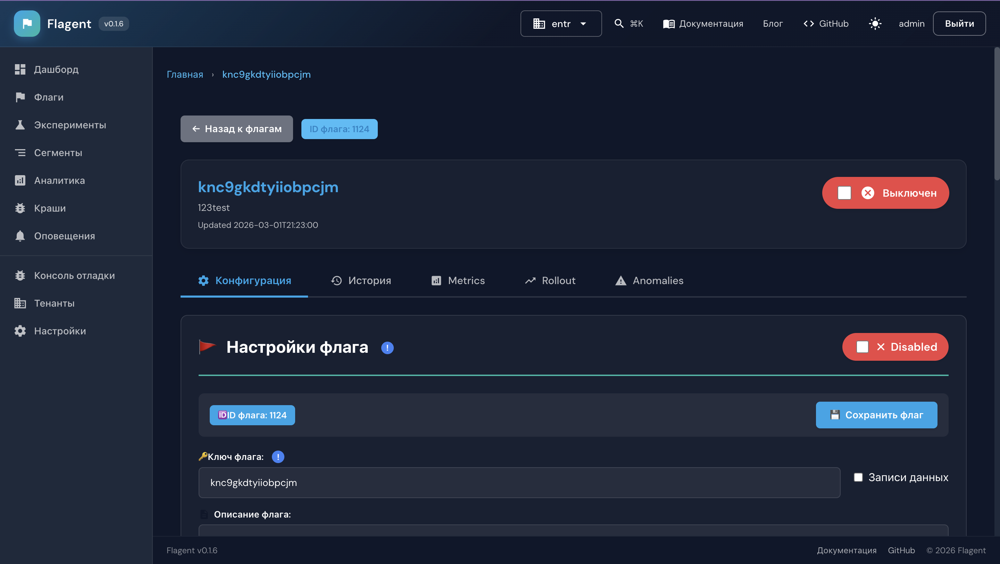
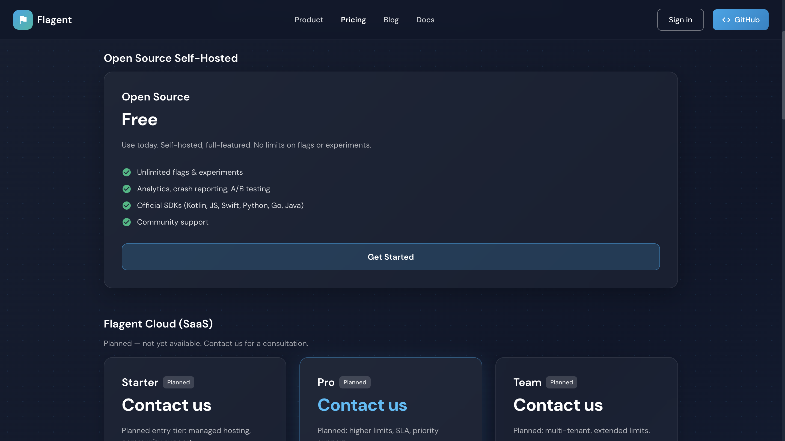

<div align="center">
  <p><strong>English</strong> | <a href="README.ru.md">Русский</a></p>
  <h1>Flagent</h1>
  <p>
    
  </p>
  <p><strong>Ship Features Safely. Experiment Confidently.</strong></p>
  <p>The first Kotlin-native feature flag platform: type-safe, coroutine-first flags and experimentation; optional Smart Rollout and anomaly detection (Enterprise).</p>
  
  <p>
    <a href="https://github.com/MaxLuxs/Flagent/actions/workflows/ci.yml?query=branch%3Amain+">
      
    </a>
    <a href="https://github.com/MaxLuxs/Flagent/actions/workflows/ci-swift.yml?query=branch%3Amain+">
      
    </a>
    <a href="https://codecov.io/gh/MaxLuxs/Flagent">
      
    </a>
    <a href="https://github.com/MaxLuxs/Flagent/releases">
      
    </a>
    <a href="https://github.com/MaxLuxs/Flagent/blob/main/LICENSE">
      
    </a>
  </p>
  
  <p>
    <a href="https://github.com/MaxLuxs/Flagent/stargazers">
      
    </a>
    <a href="https://github.com/MaxLuxs/Flagent/network/members">
      
    </a>
    <a href="https://github.com/MaxLuxs/Flagent/graphs/contributors">
      
    </a>
  </p>
  
  <p>
    <a href="#-quick-start">Quick Start</a> •
    <a href="https://maxluxs.github.io/Flagent/guides/getting-started.md">Documentation</a> •
    <a href="#-key-features">Features</a> •
    <a href="#-sdks">SDKs</a> •
    <a href="#-use-cases">Use Cases</a> •
    <a href="docs/guides/pricing-and-editions.md">Pricing & editions</a> •
    <a href="docs/guides/roadmap.md">Roadmap</a>
  </p>
</div>

---

**Flagent** is a modern, production-ready feature flag and experimentation platform built with **Kotlin/Ktor**. The first Kotlin-native solution in the feature flags ecosystem, combining type-safety, coroutines, and clean architecture for high-performance feature management. Enterprise build adds multi-tenancy, SSO, RBAC, Smart Rollout and anomaly detection.

**Problem → Solution:** Teams need to ship features safely, run A/B tests, and roll back instantly without redeploys. Flagent gives you feature flags, experiments, gradual rollouts, kill switches, and optional crash-by-flag analytics in one self-hosted or (planned) cloud platform — with Kotlin-native SDKs and a single UI.

**Full landing (product overview, pricing, CTA):** When running Flagent with the marketing landing enabled (`ENV_SHOW_LANDING=true`), open the app root (e.g. `http://localhost:18000`). See also [Documentation](https://maxluxs.github.io/Flagent/guides/getting-started.md) and [Pricing & editions](docs/guides/pricing-and-editions.md).

**Project status:** Flagent is in **active development**; we ship updates regularly. **Flagent Cloud (SaaS)** is planned but not yet launched. We welcome [sponsors](https://github.com/sponsors/MaxLuxs) and community support — see [Roadmap](docs/guides/roadmap.md).

## 🎯 Why Flagent?

### Kotlin-Native Excellence
- **Industry-Standard Evaluation API** - Easy migration from existing feature flag solutions
- **Type-Safe SDKs** - Compile-time validation and IDE autocomplete
- **Coroutine-First** - Non-blocking I/O and structured concurrency
- **Ktor Ecosystem** - Seamless integration with Ktor applications
- **Clean Architecture** - DDD principles and testable design

### Smart Rollout and Anomaly (Enterprise)
- **Smart Rollout** - Configurable automated gradual rollouts (metrics-based; Enterprise).
- **Anomaly Detection** - Alerts and optional rollback on degradation (Enterprise).
- **Roadmap:** Predictive targeting, A/B insights, ML-based automation.

### Enterprise-Ready
- **Extensive test coverage** - 200+ test files
- **High Performance** - Low latency evaluation, load-tested (see [docs/performance/benchmarks.md](docs/performance/benchmarks.md))
- **Multi-Tenancy** - Isolated environments for teams (Enterprise)
- **Real-Time Updates** - SSE in Kotlin Enhanced, Go Enhanced

## 🚀 Quick Start

Get Flagent running in under 5 minutes:

### Option 1: Docker with In-Memory Database (Quickest)

```bash
docker pull ghcr.io/maxluxs/flagent
docker run -d --name flagent -p 18000:18000 \
  -e FLAGENT_DB_DBDRIVER="sqlite3" \
  -e FLAGENT_DB_DBCONNECTIONSTR=":memory:" \
  ghcr.io/maxluxs/flagent

# Open Flagent UI
open http://localhost:18000
```

**Default credentials:** `admin@local` / `admin`

⚠️ **Note:** In-memory database is reset on container restart. Use **Option 2** for persistent data.

### Option 2: Docker with Persistent SQLite

```bash
docker run -d --name flagent -p 18000:18000 \
  -v flagent-db:/data \
  -e FLAGENT_DB_DBDRIVER="sqlite3" \
  -e FLAGENT_DB_DBCONNECTIONSTR="/data/flagent.sqlite" \
  ghcr.io/maxluxs/flagent

# Open Flagent UI
open http://localhost:18000
```

Data persists in the `flagent-db` volume across container restarts.

### Option 3: Docker Compose with PostgreSQL (Production)

```bash
git clone https://github.com/MaxLuxs/Flagent.git
cd Flagent
docker compose up -d

# Open Flagent UI
open http://localhost:18000
```

See [docker-compose.yml](docker-compose.yml) for PostgreSQL setup.

### Screenshots

| Dashboard | Flags list | Debug Console |
|-----------|------------|---------------|
|  |  |  |
| **Experiments (A/B)** | **Create Flag** | **Pricing** |
|  |  |  |

### Environment Variables

**Database Configuration (required):**
- `FLAGENT_DB_DBDRIVER` - Database driver: `sqlite3`, `postgres`, `mysql` (default: `sqlite3`)
- `FLAGENT_DB_DBCONNECTIONSTR` - Connection string:
  - SQLite file: `/data/flagent.sqlite` or `./flagent.sqlite`
  - SQLite memory: `:memory:`
  - PostgreSQL: `jdbc:postgresql://localhost:5432/flagent`
  - MySQL: `jdbc:mysql://localhost:3306/flagent`

**Admin Authentication (default: `admin@local` / `admin`):**
- `FLAGENT_ADMIN_EMAIL` - Admin email (default: `admin@local`)
- `FLAGENT_ADMIN_PASSWORD` - Admin password (default: `admin`)
- `FLAGENT_JWT_AUTH_SECRET` - JWT secret for tokens (min 32 chars, required for production)

**Server:**
- `PORT` - Server port (default: `18000`)

For production: set `FLAGENT_ADMIN_EMAIL`, `FLAGENT_ADMIN_PASSWORD`, `FLAGENT_JWT_AUTH_SECRET` (min 32 chars). See [Configuration](docs/guides/configuration.md).

## Self-Hosted (Open Source) from GitHub

Run backend and frontend from the public repo (no Enterprise submodule = single-tenant, no X-API-Key).

**1. Clone (without internal submodule):**
```bash
git clone https://github.com/MaxLuxs/Flagent.git flagent && cd flagent
# Do not run: git submodule update --init internal  (that would pull Enterprise)
```

**2. Run backend and frontend together (dev):**
```bash
./gradlew run
```
- Backend: http://localhost:18000 (API, health, Swagger at /docs)
- **Java 21 required.** If you see `UnsupportedClassVersionError`, set `JAVA_HOME` to JDK 21 (e.g. `~/.gradle/jdks/eclipse_adoptium-21-*/jdk-*/Contents/Home` when Gradle auto-provisions it)
- Frontend: http://localhost:8080 (Compose dev server; uses `ENV_API_BASE_URL` → 18000)
- Requires `org.gradle.parallel=true` (default in `gradle.properties`). Ctrl+C stops both.

**3. Or run separately:**
```bash
# Terminal 1 – backend
./gradlew :backend:run

# Terminal 2 – frontend
./gradlew :frontend:jsBrowserDevelopmentRun
```
Then open http://localhost:8080. Frontend defaults to edition `open_source` and `ENV_API_BASE_URL=http://localhost:18000` in `frontend/src/jsMain/resources/index.html`.

**4. Production-like (single process):** build frontend so backend can serve static files, then run backend from repo root:
```bash
./gradlew :frontend:jsBrowserDevelopmentWebpack
./gradlew :backend:run
```
Backend serves the UI from `frontend/build/dist/js/developmentExecutable` when present; open http://localhost:18000.

**Docker:** The image includes UI. Single `docker run` gives you full Flagent at http://localhost:18000.

**Docker Compose (production-like):** For PostgreSQL and persistent data, use `docker compose up -d`. See [docker-compose.yml](docker-compose.yml).

### Advanced: Enterprise

**With Enterprise (internal submodule):** Admin login and protected `/admin/*` are available. See [frontend/EDITION_GUIDE.md](frontend/EDITION_GUIDE.md) for first run (admin env → login → create tenant) and [docs/guides/configuration.md](docs/guides/configuration.md) for Admin Auth variables.

**OSS frontend + Enterprise backend:** If you build the frontend as Open Source (default) but run the backend with `internal` (enterprise), you will get 401 until a tenant exists. The UI shows "Create tenant first: POST /admin/tenants" and two actions: **Create first tenant** (opens /tenants) and **Log in (admin)** (opens /login). Set on the backend: `FLAGENT_ADMIN_AUTH_ENABLED=true`, `FLAGENT_ADMIN_EMAIL`, `FLAGENT_ADMIN_PASSWORD`, `FLAGENT_JWT_AUTH_SECRET` (min 32 chars), and optionally `FLAGENT_ADMIN_API_KEY`. Then log in at /login or create a tenant at /tenants.

**"Admin auth is disabled"** when logging in means the backend has admin login turned off. Set `FLAGENT_ADMIN_AUTH_ENABLED=true` and the env vars above on the backend and restart. See [docs/guides/configuration.md](docs/guides/configuration.md) → Admin Auth.

**Login first (always show login screen):** In the frontend set `ENV_FEATURE_AUTH=true` (e.g. in `frontend/src/jsMain/resources/index.html` or via `?ENV_FEATURE_AUTH=true`). Unauthenticated users will be redirected to /login before seeing the dashboard.

**Auth in Open Source:** Auth is enabled by default. Configure `FLAGENT_ADMIN_EMAIL`, `FLAGENT_ADMIN_PASSWORD`, `FLAGENT_JWT_AUTH_SECRET` (min 32 chars) on the backend. To disable (open access, dev only): `FLAGENT_ADMIN_AUTH_ENABLED=false` and `ENV_FEATURE_AUTH=false` (frontend). See [frontend/EDITION_GUIDE.md](frontend/EDITION_GUIDE.md) → Authentication in Open Source.

## ✨ Key Features

### Core Features (Available Now)
- ✅ **Feature Flags** - Gradual rollouts, kill switches, and remote configuration
- ✅ **A/B Testing** - Multi-variant experiments with deterministic bucketing (MurmurHash3)
- ✅ **Advanced Targeting** - Segment users by attributes, percentages, or complex constraint rules
- ✅ **Multi-Environment** - Separate configurations for dev, staging, and production
- ✅ **Data Recorders** - Kafka, Kinesis, PubSub integration for analytics
- ✅ **High Performance** - Low-latency evaluation with EvalCache and TTL
- ✅ **Client-Side Evaluation** - Offline-first local evaluation in Kotlin Enhanced, Go Enhanced
- ✅ **Real-Time Updates** - SSE for instant flag changes in Kotlin Enhanced, Go Enhanced
- ✅ **Multiple Databases** - PostgreSQL, MySQL, SQLite support
- ✅ **Docker Ready** - Production-ready Docker images with Compose
- ✅ **Official SDKs** - Kotlin, JavaScript/TypeScript, Swift, Python, Go with Enhanced variants
- ✅ **Ktor Plugin** - First-class Ktor server-side integration
- ✅ **Admin UI** - Modern Compose for Web dashboard
- ✅ **Debug Console** - Real-time evaluation testing and debugging

### Import/Export and Enterprise (internal module)
- ✅ **Import/Export** - Flags as YAML/JSON: POST /import and export from Settings (OSS). No git sync or CLI yet.
- ✅ **Multi-Tenancy** - Tenants, API key per tenant, X-Tenant-ID, tenant switcher in UI (Enterprise).
- ✅ **SSO** - SAML and OAuth/OIDC providers, tenant-scoped login and JWT (Enterprise). Works with any IdP (e.g. Okta, Auth0, Azure AD).
- ✅ **RBAC** - Custom roles and permissions, enforced on API routes (Enterprise).
- ✅ **Smart Rollout & Anomaly** - Automated gradual rollout config and anomaly alerts with rollback options (Enterprise). No ML model; rules and metrics-based.

## 📖 Documentation

- 📖 **[Getting Started](https://maxluxs.github.io/Flagent/guides/getting-started.md)** - Quick start and setup
- 📖 **[API Compatibility](https://maxluxs.github.io/Flagent/guides/compatibility.md)** - Evaluation API, migration guide
- 📖 **[API Reference](https://maxluxs.github.io/Flagent)** - API docs and OpenAPI
- 📖 **[OpenAPI spec](https://maxluxs.github.io/Flagent/api/openapi.yaml)** - OpenAPI specification
- 📖 **[Architecture](https://maxluxs.github.io/Flagent/architecture/backend.md)** - System design

## 🏗️ Project Structure

```
flagent/
├── backend/          # Ktor backend (Clean Architecture)
├── frontend/         # Compose for Web UI
├── sdk/              # Client SDKs
│   ├── kotlin/       # Kotlin (KMP) base client
│   ├── kotlin-enhanced/   # Client-side eval, SSE
│   ├── kotlin-debug-ui/  # Compose debug dashboard
│   ├── flagent-koin/     # Koin DI module
│   ├── java/         # Java client
│   ├── spring-boot-starter/
│   ├── javascript/   # JS/TS base
│   ├── javascript-enhanced/
│   ├── javascript-debug-ui/
│   ├── swift/        # Swift base
│   ├── swift-enhanced/
│   ├── swift-debug-ui/
│   ├── python/
│   ├── go/
│   ├── go-enhanced/
│   ├── dart/         # Dart base
│   └── flutter-enhanced/
├── ktor-flagent/     # Ktor plugin
└── docs/guides/roadmap.md   # Development roadmap
```

## Development

**Version:** single source is root file `VERSION`. Gradle reads it; run `./scripts/sync-version.sh` to propagate to npm/pip/Go/Swift/Helm/Java. See [docs/guides/versioning.md](docs/guides/versioning.md).

### Requirements
- JDK 21+
- Gradle 8.13 (wrapper)

### Build
```bash
./gradlew build
```

### Run Backend
```bash
./gradlew :backend:run
```

### Configuration
All settings via environment variables. See [AppConfig.kt](backend/src/main/kotlin/flagent/config/AppConfig.kt) for options.

Example:
```bash
export FLAGENT_DB_DBDRIVER=sqlite3
export FLAGENT_DB_DBCONNECTIONSTR=flagent.sqlite
export PORT=18000
./gradlew :backend:run
```

### API Documentation (when server running)
- **Swagger UI**: http://localhost:18000/docs
- **OpenAPI YAML**: http://localhost:18000/api/v1/openapi.yaml

## 📚 SDKs

Official SDKs available for multiple platforms. The Kotlin SDK is **full Kotlin Multiplatform (KMP)**: `kotlin-client`, `kotlin-enhanced`, `kotlin-debug-ui`, and `flagent-koin` support JVM, Android, iOS, JS, and Native (linuxX64, mingwX64, macosX64).

| Language | Package | CI | Status | Features |
|----------|---------|:--:|--------|----------|
| **Kotlin (KMP)** | [kotlin](sdk/kotlin) | [](https://github.com/MaxLuxs/Flagent/actions/workflows/ci.yml) | ✅ Stable | Full API, JVM/Android/iOS/JS/Native |
| **Kotlin Enhanced** | [kotlin-enhanced](sdk/kotlin-enhanced) | [](https://github.com/MaxLuxs/Flagent/actions/workflows/ci.yml) | ✅ Stable | Client-side eval, real-time, KMP |
| **Kotlin Debug UI** | [kotlin-debug-ui](sdk/kotlin-debug-ui) | [](https://github.com/MaxLuxs/Flagent/actions/workflows/ci.yml) | ✅ Stable | Compose Multiplatform debug dashboard, JVM/Android/iOS |
| **flagent-koin** | [flagent-koin](sdk/flagent-koin) | [](https://github.com/MaxLuxs/Flagent/actions/workflows/ci.yml) | ✅ Stable | Koin DI module for Flagent, KMP |
| **Kotlin OpenFeature-like** | [kotlin-openfeature](sdk/kotlin-openfeature) | [](https://github.com/MaxLuxs/Flagent/actions/workflows/ci.yml) | ⚙️ Experimental | OpenFeature-style KMP client backed by Flagent evaluation API |
| **Java** | [java](sdk/java) | [](https://github.com/MaxLuxs/Flagent/actions/workflows/ci.yml) | ✅ Stable | Full API support, Maven |
| **Spring Boot** | [spring-boot-starter](sdk/spring-boot-starter) | [](https://github.com/MaxLuxs/Flagent/actions/workflows/ci.yml) | ✅ Stable | Auto-configuration, Ktor/Java client |
| **JavaScript/TypeScript** | [javascript](sdk/javascript) | [](https://github.com/MaxLuxs/Flagent/actions/workflows/ci.yml) | ✅ Stable | Full API support, async/await |
| **JavaScript Enhanced** | [javascript-enhanced](sdk/javascript-enhanced) | [](https://github.com/MaxLuxs/Flagent/actions/workflows/ci.yml) | ✅ Stable | Caching, convenient API |
| **JavaScript Debug UI** | [javascript-debug-ui](sdk/javascript-debug-ui) | [](https://github.com/MaxLuxs/Flagent/actions/workflows/ci.yml) | ✅ Stable | React debug UI for Web |
| **Swift** | [swift](sdk/swift) | [](https://github.com/MaxLuxs/Flagent/actions/workflows/ci-swift.yml) | ✅ Stable | Full API support, async/await |
| **Swift Enhanced** | [swift-enhanced](sdk/swift-enhanced) | [](https://github.com/MaxLuxs/Flagent/actions/workflows/ci-swift.yml) | ✅ Stable | Caching, convenient API |
| **Swift Debug UI** | [swift-debug-ui](sdk/swift-debug-ui) | [](https://github.com/MaxLuxs/Flagent/actions/workflows/ci-swift.yml) | ✅ Stable | SwiftUI debug UI for iOS |
| **Python** | [python](sdk/python) | [](https://github.com/MaxLuxs/Flagent/actions/workflows/ci.yml) | ✅ Stable | Full API support, asyncio |
| **Go** | [go](sdk/go) | [](https://github.com/MaxLuxs/Flagent/actions/workflows/ci.yml) | ✅ Stable | Full API support, goroutines |
| **Go Enhanced** | [go-enhanced](sdk/go-enhanced) | [](https://github.com/MaxLuxs/Flagent/actions/workflows/ci.yml) | ✅ Stable | Client-side eval, real-time updates |
| **Dart** | [dart](sdk/dart) | [](https://github.com/MaxLuxs/Flagent/actions/workflows/ci.yml) | ✅ Stable | Full API support, Flutter/iOS/Android/Web |
| **Flutter Enhanced** | [flutter-enhanced](sdk/flutter-enhanced) | [](https://github.com/MaxLuxs/Flagent/actions/workflows/ci.yml) | ✅ Stable | Caching, convenient API |

**CI:** Kotlin/Java/JS/Go/Python/Dart SDKs are built (and tested where applicable) in [ci.yml](.github/workflows/ci.yml). Swift SDKs use [ci-swift.yml](.github/workflows/ci-swift.yml). **Coverage:** [Codecov](https://codecov.io/gh/MaxLuxs/Flagent) (backend); per-SDK coverage badges planned.

### Add as dependency (Kotlin/JVM)

Artifacts are published to [GitHub Packages](https://github.com/MaxLuxs/Flagent/packages). Add the repository and dependency:

**Gradle (Kotlin DSL):**

```kotlin
repositories {
    mavenCentral()
    maven {
        url = uri("https://maven.pkg.github.com/MaxLuxs/Flagent")
        credentials {
            username = project.findProperty("gpr.user") as String? ?: System.getenv("GITHUB_ACTOR")
            password = project.findProperty("gpr.token") as String? ?: System.getenv("GITHUB_TOKEN")
        }
    }
}

dependencies {
    // Ktor plugin (server)
    implementation("com.flagent:ktor-flagent:0.1.6")
    // Kotlin client
    implementation("com.flagent:kotlin-client:0.1.6")
    // Kotlin Enhanced (offline eval, SSE)
    implementation("com.flagent:kotlin-enhanced:0.1.6")
    // Kotlin Debug UI
    implementation("com.flagent:kotlin-debug-ui:0.1.6")
    // Shared (KMP; pulled transitively by ktor-flagent, or use for multi-platform)
    implementation("com.flagent:shared:0.1.6")
}
```

Replace the version with the value from root [`VERSION`](VERSION) or [Releases](https://github.com/MaxLuxs/Flagent/releases).

Published artifacts: `shared` (KMP), `ktor-flagent`, `kotlin-client`, `kotlin-enhanced`, `kotlin-debug-ui`, `flagent-koin`, `flagent-java-client` (Maven), `flagent-spring-boot-starter`. For public read use a [GitHub PAT](https://github.com/settings/tokens) with `read:packages` (or `GITHUB_TOKEN` in CI). Replace version with the [latest release](https://github.com/MaxLuxs/Flagent/releases).

### Server-Side Integration

- **Ktor Plugin** - [ktor-flagent](ktor-flagent) - First-class Ktor integration with middleware support

See [Getting Started](https://maxluxs.github.io/Flagent/guides/getting-started.md) and [API Reference](https://maxluxs.github.io/Flagent) for usage guides.

## 🛠️ Technology Stack

- **Kotlin** - Modern JVM language with coroutines
- **Ktor** - Web framework for building async applications
- **Exposed** - Type-safe SQL framework
- **Kotlinx Serialization** - JSON serialization
- **Compose for Web** - Modern UI framework
- **PostgreSQL/MySQL/SQLite** - Database support

## 📦 Installation

### Docker (Recommended)

```bash
docker pull ghcr.io/maxluxs/flagent
docker run -d -p 18000:18000 ghcr.io/maxluxs/flagent
```

Without env vars the backend uses SQLite file `flagent.sqlite` inside the container (data lost on restart). For persistent data use a volume — see [Quick Start → Option 2](#option-2-docker-with-persistent-sqlite) above.

### Docker Compose (with PostgreSQL)

```bash
git clone https://github.com/MaxLuxs/Flagent.git
cd Flagent
docker compose up -d
```

### Build from Source

```bash
git clone https://github.com/MaxLuxs/Flagent.git
cd Flagent
./gradlew build
./gradlew :backend:run
```

See [Deployment Guide](https://maxluxs.github.io/Flagent/guides/deployment.md) for production setup.

## 📌 Repository

**GitHub topics** (set in repo settings): `feature-flags`, `kotlin`, `kotlin-multiplatform`, `ab-testing`, `experimentation`, `launchdarkly-alternative`, `crash-reporting`, `feature-toggle`.

**Releases:** See [Releases](https://github.com/MaxLuxs/Flagent/releases) for versions and release notes. For the next release, see [Contributing](https://maxluxs.github.io/Flagent/guides/contributing.md) or internal release checklist.

## 🤝 Contributing

Fork → branch → change (follow [code style](https://maxluxs.github.io/Flagent/guides/contributing.md)) → add tests → PR. We welcome bug fixes, features from the [roadmap](docs/guides/roadmap.md), docs, and SDKs. See [Contributing Guide](https://maxluxs.github.io/Flagent/guides/contributing.md) and [Development](README.md#development).

## 📄 License

Flagent is licensed under the **Apache License 2.0**. See [LICENSE](LICENSE) for details.

## 🗺️ Roadmap

[Full roadmap](docs/guides/roadmap.md) — Phase 1 (Q1 2026) done (core, SDKs, import/export, Enterprise); Phase 2–4 planned (CLI, webhooks, .NET, Edge, audit, SaaS, AI, Terraform/K8s, SOC 2).

## 🎯 Use Cases

Feature flags & rollbacks, A/B testing, gradual rollouts, kill switches, user segmentation, dynamic config, canary releases. See [use cases guide](https://maxluxs.github.io/Flagent/guides/use-cases.md).

## 📊 Performance

Sub-10ms p99 evaluation, EvalCache with TTL, horizontal scaling. [Benchmarks](docs/performance/benchmarks.md).

## 🔗 Links & Support

- 📖 [Documentation](https://maxluxs.github.io/Flagent/guides/getting-started.md) · [API Reference](https://maxluxs.github.io/Flagent) · [Samples](samples/README.md)
- 🐳 [Container (GHCR)](https://github.com/MaxLuxs/Flagent/pkgs/container/flagent) · 📦 [Releases](https://github.com/MaxLuxs/Flagent/releases) · 🐛 [Issues](https://github.com/MaxLuxs/Flagent/issues)
- 💝 [Sponsor](https://github.com/sponsors/MaxLuxs) · 📧 **Contact:** max.developer.luxs@gmail.com (support, professional services, Flagent Cloud when available)

---

**Made with ❤️ by the Flagent team**
