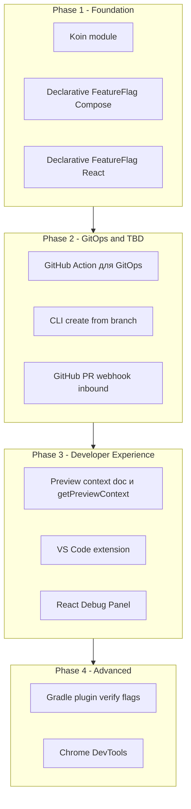

# Flagent Improvement Plan

> Детальный план реализации фич для дифференциации от конкурентов: Koin, Trunk-based development, Declarative UI, GitOps, IDE/DevTools, Build-time verification.

---

## Содержание

1. [Koin Module](#1-koin-module-flagent-koin)
2. [Trunk-Based Development Workflow](#2-trunk-based-development-workflow)
3. [Preview PR Context](#3-preview-pr-context-и-pr-aware-evaluation)
4. [Declarative UI](#4-declarative-ui)
5. [GitOps и CI](#5-gitops-и-ci)
6. [IDE и DevTools](#6-ide-и-devtools)
7. [Gradle Build-Time Verification](#7-gradle-build-time-verification)
8. [Порядок реализации](#8-порядок-реализации)

---

## 1. Koin Module (`flagent-koin`)

### 1.1 Структура модуля

```
sdk/flagent-koin/
├── build.gradle.kts
├── README.md
└── src/main/kotlin/com/flagent/koin/
    ├── FlagentModule.kt          # define module
    ├── FlagentModuleKtor.kt      # Ktor-specific (server-side)
    ├── FlagentModuleClient.kt     # Client SDK (Android, KMP)
    └── FlagentProperties.kt      # config/data class
```

### 1.2 Зависимости

В `gradle/libs.versions.toml` добавить:

```toml
[versions]
koin = "4.0.0"  # или актуальная версия

[libraries]
koin-core = { module = "io.insert-koin:koin-core", version.ref = "koin" }
koin-ktor = { module = "io.insert-koin:koin-ktor", version.ref = "koin" }
```

В `sdk/flagent-koin/build.gradle.kts`:

- `implementation(libs.koin.core)`
- `implementation(project(":kotlin-client"))` или `implementation(project(":kotlin-enhanced"))`
- Опционально: `implementation(libs.koin.ktor)` для Ktor

### 1.3 Реализация

**FlagentProperties.kt** — аналог FlagentProperties из Spring Boot:

```kotlin
package com.flagent.koin

data class FlagentProperties(
    val baseUrl: String = "http://localhost:18000",
    val connectTimeoutMs: Int = 5000,
    val readTimeoutMs: Int = 10000,
    val cache: CacheProperties = CacheProperties()
)

data class CacheProperties(
    val enabled: Boolean = true,
    val ttlMs: Long = 60000
)
```

**FlagentModuleClient.kt** — для клиентских приложений (Android, KMP):

```kotlin
package com.flagent.koin

import com.flagent.client.apis.EvaluationApi
import com.flagent.enhanced.config.FlagentConfig
import com.flagent.enhanced.manager.FlagentManager
import io.ktor.client.HttpClient
import io.ktor.client.engine.cio.CIO
import io.ktor.client.plugins.contentnegotiation.ContentNegotiation
import io.ktor.serialization.kotlinx.json.json
import kotlinx.serialization.json.Json
import org.koin.core.module.Module
import org.koin.core.module.dsl.singleOf
import org.koin.dsl.module

fun flagentClientModule(
    baseUrl: String,
    config: FlagentConfig = FlagentConfig(),
    useEnhanced: Boolean = true
): Module = module {
    single {
        HttpClient(CIO) {
            install(ContentNegotiation) {
                json(Json {
                    ignoreUnknownKeys = true
                    isLenient = true
                    encodeDefaults = false
                })
            }
        }
    }
    single {
        val url = baseUrl.trimEnd('/').let { if (it.endsWith("/api/v1")) it else "$it/api/v1" }
        EvaluationApi(baseUrl = url, httpClientEngine = get<HttpClient>().engine)
    }
    if (useEnhanced) {
        single { FlagentManager(get(), config) }
    }
}
```

**FlagentModuleKtor.kt** — для Ktor-сервера (если нужен DI серверной части):

```kotlin
package com.flagent.koin

import org.koin.core.module.Module
import org.koin.dsl.module

data class FlagentKtorConfig(
    var flagentBaseUrl: String = "http://localhost:18000",
    var enableEvaluation: Boolean = true,
    var enableCache: Boolean = true,
    var cacheTtlMs: Long = 60000
)

fun flagentKtorModule(block: FlagentKtorConfig.() -> Unit = {}): Module = module {
    val config = FlagentKtorConfig().apply(block)
    // Интеграция с ktor-flagent: single { getFlagentClient() } через Ktor Application
    // Требует доработки ktor-flagent плагина для поддержки Koin
}
```

### 1.4 Регистрация в проекте

В `settings.gradle.kts` добавить:

```kotlin
include(":flagent-koin")
project(":flagent-koin").projectDir = file("sdk/flagent-koin")
```

Добавить публикацию в `gradle/publish.gradle.kts` (если есть общий publish script).

### 1.5 Обновление android-sample

Заменить `sdk/android-sample/app/src/main/java/com/flagent/sample/di/AppModule.kt` на Koin:

- Добавить в `build.gradle.kts`: `implementation(project(":flagent-koin"))`
- В `FlagentSampleApplication.kt`: `startKoin { modules(flagentClientModule(baseUrl, config)) }`
- Удалить или заменить `AppModule` на вызовы `get<FlagentManager>()` через Koin

---

## 2. Trunk-Based Development Workflow

### 2.1 Конвенция именования (branch → flag)

Правило: `feature/xxx` → `xxx` или `feature_xxx`, `fix/xxx` → `fix_xxx`.

**Реализация** — утилита в shared или backend:

```kotlin
// shared/src/commonMain/kotlin/.../TrunkUtils.kt
// или backend/.../util/TrunkUtils.kt

fun branchToFlagKey(branch: String): String {
    val normalized = branch.replace(Regex("^refs/heads/"), "")
    return normalized
        .replace("/", "_")
        .replace(Regex("[^a-zA-Z0-9_]"), "_")
        .lowercase()
        .takeIf { it.isNotBlank() } ?: "unnamed"
}
```

### 2.2 Расширение CLI

Текущий CLI: `scripts/flagent-cli.sh` (bash) — export/import.

**Новые команды**:

- `flagent flag create --from-branch [branch]` — создать флаг из имени ветки
- `flagent flag create --from-pr <pr_number>` — создать флаг по PR (через GitHub API)
- `flagent flag exists <key>` — проверить существование флага

**Реализация** — отдельный CLI на Kotlin (JVM) или расширить bash.

**Структура Kotlin CLI**:

```
scripts/
├── flagent-cli.sh           # оставить как есть (legacy)
└── flagent-cli/              # новый Kotlin CLI
    ├── build.gradle.kts
    └── src/main/kotlin/com/flagent/cli/
        ├── Main.kt
        ├── commands/
        │   ├── CreateFlagFromBranch.kt
        │   ├── CreateFlagFromPr.kt
        │   └── ExportImport.kt
        └── api/
            └── FlagentApiClient.kt
```

**CreateFlagFromBranch.kt**:

- Читать текущую ветку из `git rev-parse --abbrev-ref HEAD` или аргумент
- Вызвать `branchToFlagKey(branch)`
- HTTP `POST /api/v1/flags` с телом `{ "key": "...", "description": "Auto from branch", "enabled": false }`

**CreateFlagFromPr.kt**:

- GitHub API `GET /repos/{owner}/{repo}/pulls/{pr}` → `head.ref`
- `branchToFlagKey(head.ref)` → key
- То же создание флага

### 2.3 Webhook для PR (GitHub/GitLab)

**Новый тип**: inbound webhook — endpoint, который слушает события PR от GitHub/GitLab.

**Backend** — новые routes:

```
backend/src/main/kotlin/flagent/route/
├── WebhookRoutes.kt              # существующий (CRUD webhooks)
└── IntegrationWebhookRoutes.kt   # новый: GitHub/GitLab PR events
```

**IntegrationWebhookRoutes.kt**:

- `POST /api/v1/integrations/github/webhook` — GitHub PR events
- Верификация подписи `X-Hub-Signature-256` (HMAC SHA256)
- Парсинг события `pull_request` с `action: opened` / `synchronize`
- Из payload: `pull_request.head.ref` → branch
- `branchToFlagKey(branch)` → flagKey
- Вызов `FlagService.createFlag(...)` или `ImportService`
- Опционально: создать комментарий в PR через GitHub API с информацией о флаге

**Модели событий**:

```kotlin
@Serializable
data class GitHubPullRequestEvent(
    val action: String,
    val pull_request: GitHubPullRequest,
    val repository: GitHubRepository
)

@Serializable
data class GitHubPullRequest(val head: GitHubHead)

@Serializable
data class GitHubHead(val ref: String)

@Serializable
data class GitHubRepository(val full_name: String)
```

**Конфигурация** (AppConfig):

- `FLAGENT_GITHUB_WEBHOOK_SECRET` — секрет для верификации
- `FLAGENT_GITHUB_AUTO_CREATE_FLAG` — boolean, включать ли автоподсказку/создание флага

---

## 3. Preview PR Context и PR-aware Evaluation

### 3.1 Резервированные ключи entityContext

Договориться о ключах (документация):

- `_preview_pr` — номер PR (string)
- `_preview_env` — имя окружения (например `pr-123`)
- `_branch` — ветка

SDK не меняет поведение — это договорённость по контексту. Backend уже поддерживает произвольный `entityContext`.

### 3.2 Сегмент "Preview PR"

В UI администратора:

- Создать сегмент "Preview PR #123" с constraint: `_preview_pr` EQ `123`
- Или `_preview_env` EQ `pr-123`

Используется как обычный сегмент.

### 3.3 Автоматическая передача контекста в Preview

Preview-среда (Vercel, Netlify, Cloudflare Pages) передаёт env vars. Нужна утилита для frontend.

**В `sdk/javascript-enhanced`** добавить:

```typescript
// src/preview/getPreviewContext.ts

/**
 * Returns entityContext for preview/PR environments.
 * Use in Vercel, Netlify, Cloudflare Pages preview deployments.
 */
export function getPreviewContext(): Record<string, string> | null {
  const pr = process.env.VERCEL_GIT_PULL_REQUEST_ID
    ?? process.env.REVIEW_ID
    ?? process.env.CF_PAGES_PULL_REQUEST;
  const branch = process.env.VERCEL_GIT_COMMIT_REF
    ?? process.env.BRANCH
    ?? process.env.CF_PAGES_BRANCH;
  if (!pr && !branch) return null;
  return {
    ...(pr && { _preview_pr: String(pr) }),
    ...(branch && { _branch: branch }),
    ...(pr && { _preview_env: `pr-${pr}` })
  };
}
```

**Документация**: `docs/guides/preview-environments.md` — описание, примеры для Vercel/Netlify.

---

## 4. Declarative UI

### 4.1 Compose

**Модуль**: расширить `sdk/kotlin-debug-ui` или создать `sdk/kotlin-compose-ui`.

Текущее состояние: `sdk/kotlin-debug-ui` — заглушка, Compose не подключён.

**Добавить в build.gradle.kts**:

- `compose` + `compose-bom`
- `implementation(project(":kotlin-enhanced"))`

**FeatureFlag.kt**:

```kotlin
package com.flagent.debug.ui

import androidx.compose.runtime.Composable
import androidx.compose.runtime.produceState
import com.flagent.enhanced.manager.FlagentManager

@Composable
fun FeatureFlag(
    key: String,
    manager: FlagentManager,
    entityID: String = "default",
    entityType: String? = null,
    entityContext: Map<String, Any>? = null,
    fallback: @Composable () -> Unit = {},
    content: @Composable () -> Unit
) {
    val enabled by produceState(initialValue = false, key, entityID) {
        value = kotlinx.coroutines.runBlocking {
            manager.evaluate(
                flagKey = key,
                entityID = entityID,
                entityType = entityType,
                entityContext = entityContext
            ).variantKey != "disabled"
        }
    }
    if (enabled) content() else fallback()
}
```

**CompositionLocal**:

```kotlin
val LocalFlagentManager = staticCompositionLocalOf<FlagentManager> {
    error("No FlagentManager provided")
}
```

**FlagentProvider**:

```kotlin
@Composable
fun FlagentProvider(
    manager: FlagentManager,
    content: @Composable () -> Unit
) {
    CompositionLocalProvider(LocalFlagentManager provides manager) {
        content()
    }
}
```

**Использование**:

```kotlin
FlagentProvider(manager = manager) {
    FeatureFlag(key = "new_checkout", fallback = { OldCheckout() }) {
        NewCheckout()
    }
}
```

### 4.2 React

**Модуль**: `sdk/javascript-react` или расширить `sdk/javascript-debug-ui`.

**Структура**:

```
sdk/javascript-react/
├── package.json
├── tsconfig.json
└── src/
    ├── index.ts
    ├── FeatureFlag.tsx
    ├── FlagentProvider.tsx
    ├── FlagentContext.tsx
    └── useFlag.ts
```

**useFlag.ts**:

```typescript
import { useState, useEffect } from 'react';
import { FlagentManager } from '@flagent/enhanced-client';

export function useFlag(
  manager: FlagentManager,
  key: string,
  entityID?: string,
  entityContext?: Record<string, any>
): { enabled: boolean; loading: boolean } {
  const [enabled, setEnabled] = useState(false);
  const [loading, setLoading] = useState(true);
  useEffect(() => {
    manager.evaluate({ flagKey: key, entityID, entityContext })
      .then(r => setEnabled((r.variantKey ?? 'disabled') !== 'disabled'))
      .finally(() => setLoading(false));
  }, [manager, key, entityID, JSON.stringify(entityContext ?? {})]);
  return { enabled, loading };
}
```

**FeatureFlag.tsx**:

```tsx
import React, { useContext } from 'react';
import { FlagentManager } from '@flagent/enhanced-client';
import { FlagentContext } from './FlagentContext';
import { useFlag } from './useFlag';

export const FeatureFlag: React.FC<{
  flagKey: string;
  fallback?: React.ReactNode;
  entityID?: string;
  entityContext?: Record<string, any>;
  children: React.ReactNode;
}> = ({ flagKey, fallback = null, entityID, entityContext, children }) => {
  const manager = useContext(FlagentContext);
  const { enabled, loading } = useFlag(manager, flagKey, entityID, entityContext);
  if (loading) return <>{fallback ?? null}</>;
  return <>{enabled ? children : fallback}</>;
};
```

**FlagentProvider.tsx**:

```tsx
import React from 'react';
import { FlagentManager } from '@flagent/enhanced-client';
import { FlagentContext } from './FlagentContext';

export const FlagentProvider: React.FC<{
  manager: FlagentManager;
  children: React.ReactNode;
}> = ({ manager, children }) => (
  <FlagentContext.Provider value={manager}>{children}</FlagentContext.Provider>
);
```

---

## 5. GitOps и CI

### 5.1 Текущее состояние

- Export: `scripts/flagent-cli.sh` → `GET /api/v1/export/gitops?format=yaml`
- Import: `backend/.../ImportRoutes.kt` → `POST /api/v1/import`
- Формат: `FlagsImportFormat.kt` (JSON/YAML)

### 5.2 GitHub Action

**Файл**: `.github/workflows/flagent-sync.yml`

```yaml
name: Flagent GitOps Sync
on:
  push:
    branches: [main]
    paths: ['flags.yaml', 'flags/*.yaml']
  workflow_dispatch:
jobs:
  sync:
    runs-on: ubuntu-latest
    steps:
      - uses: actions/checkout@v4
      - name: Sync flags to Flagent
        run: |
          chmod +x scripts/flagent-cli.sh
          ./scripts/flagent-cli.sh import --url ${{ secrets.FLAGENT_URL }} --file flags.yaml --api-key ${{ secrets.FLAGENT_API_KEY }}
```

### 5.3 Расширение формата YAML

В `FlagsImportFormat.kt` (если нужно):

- `prNumber: Int?` — привязка к PR
- `branch: String?` — привязка к ветке
- `tags` — уже есть

### 5.4 Документация

- `docs/guides/gitops.md` — схема GitOps, пример `flags.yaml`, sync workflow
- Ссылка на GitHub Action в README

---

## 6. IDE и DevTools

### 6.1 VS Code / Cursor Extension

**Структура**:

```
extensions/
└── vscode-flagent/
    ├── package.json
    ├── tsconfig.json
    ├── src/
    │   ├── extension.ts
    │   ├── tree/
    │   │   └── FlagsTreeProvider.ts
    │   ├── views/
    │   │   └── FlagsView.ts
    │   └── api/
    │       └── FlagentApi.ts
    └── .vscodeignore
```

**Функции**:

- Webview или TreeView с панелью списка флагов
- Конфиг: `flagent.baseUrl`, `flagent.apiKey`
- `GET /api/v1/flags` для списка
- При клике — детали флага (GET по id)
- Кнопка Copy key для Insert Snippet

**package.json (contributes)**:

```json
{
  "contributes": {
    "views": {
      "explorer": [{ "id": "flagentFlags", "name": "Feature Flags" }]
    },
    "configuration": {
      "properties": {
        "flagent.baseUrl": { "type": "string", "default": "http://localhost:18000" },
        "flagent.apiKey": { "type": "string" }
      }
    }
  }
}
```

### 6.2 Chrome DevTools Panel (JS SDK)

**Модуль**: `@flagent/debug-ui` или `@flagent/devtools` — Chrome Extension с DevTools page.

**Реализация**:

- Chrome Extension с DevTools page
- `chrome.devtools` API
- Подключаться к странице (injected script) и читать состояние FlagentManager
- Панель: список флагов, текущие значения, overrides

**Альтернатива (проще)**: React-компонент `FlagentDebugPanel` в `@flagent/debug-ui`, который рендерится в dev-режиме в углу экрана (без расширения).

### 6.3 Приоритет

- Сначала: React Debug Panel (расширить `javascript-debug-ui`)
- Потом: VS Code extension
- Chrome DevTools — фаза 2

---

## 7. Gradle Build-Time Verification

### 7.1 Идея

Плагин сканирует аннотации `@FlagKey("xxx")` и проверяет, что флаг `xxx` существует в Flagent (через API или локальный файл).

### 7.2 Структура

```
gradle-plugins/
└── flagent-gradle-plugin/
    ├── build.gradle.kts
    └── src/main/kotlin/com/flagent/gradle/
        ├── FlagentPlugin.kt
        ├── FlagentExtension.kt
        ├── tasks/
        │   └── VerifyFlagsTask.kt
        └── scanner/
            └── FlagKeyScanner.kt
```

### 7.3 Реализация

**FlagentExtension.kt**:

```kotlin
open class FlagentExtension(@Internal val project: Project) {
    var baseUrl: String = "http://localhost:18000"
    var apiKey: String? = null
    var flagsFile: File? = null  // локальный flags.yaml вместо API
    var failOnUnknown: Boolean = true
}
```

**VerifyFlagsTask**:

1. Сканировать `*.kt` (regex или ASM) — найти `@FlagKey("...")`
2. Получить список флагов: из `flagsFile` или `GET /api/v1/flags`
3. Сравнить: если ключ из кода не найден — `fail` (если `failOnUnknown`)

**Аннотация** (в `shared` или отдельный модуль):

```kotlin
@Retention(AnnotationRetention.SOURCE)
@Target(AnnotationTarget.VALUE_PARAMETER, AnnotationTarget.FIELD, AnnotationTarget.LOCAL_VARIABLE)
annotation class FlagKey(val value: String)
```

**Использование**:

```kotlin
plugins { id("com.flagent.verify-flags") }
flagent {
    baseUrl = "https://api.flagent.example.com"
    apiKey = providers.environmentVariable("FLAGENT_API_KEY").getOrElse("")
}
```

### 7.4 Альтернатива

Без аннотаций — regex по строкам `"flag_key"` в вызовах `isEnabled`, `evaluate` и т.п. Менее надёжно.

---

## 8. Порядок реализации



### 8.1 Checklist по модулям

| Модуль | Файлы | Зависимости |
|--------|-------|-------------|
| flagent-koin | `sdk/flagent-koin/` | koin-core, kotlin-client/kotlin-enhanced |
| kotlin-compose FeatureFlag | `sdk/kotlin-debug-ui/` или новый | compose, kotlin-enhanced |
| @flagent/react | `sdk/javascript-react/` | @flagent/enhanced-client, react |
| CLI create-from-branch | `scripts/flagent-cli/` или bash | HTTP client |
| GitHub webhook | `backend/.../IntegrationWebhookRoutes.kt` | — |
| GitHub Action | `.github/workflows/flagent-sync.yml` | — |
| getPreviewContext | `sdk/javascript-enhanced/` | — |
| VS Code extension | `extensions/vscode-flagent/` | vscode |
| Gradle plugin | `gradle-plugins/flagent-gradle-plugin/` | — |

### 8.2 Документация к созданию

- `docs/guides/koin-integration.md`
- `docs/guides/trunk-based-development.md`
- `docs/guides/preview-environments.md`
- `docs/guides/gitops.md`
- `docs/guides/declarative-ui.md`
- `docs/guides/build-time-verification.md`

---

## Ссылки на существующие файлы

- [settings.gradle.kts](../../settings.gradle.kts) — регистрация модулей
- [sdk/spring-boot-starter](../../sdk/spring-boot-starter) — эталон для flagent-koin
- [backend/route/ImportRoutes.kt](../../backend/src/main/kotlin/flagent/route/ImportRoutes.kt) — import API
- [backend/service/WebhookService.kt](../../backend/src/main/kotlin/flagent/service/WebhookService.kt) — webhook dispatch
- [scripts/flagent-cli.sh](../../scripts/flagent-cli.sh) — текущий CLI
- [sdk/kotlin-debug-ui](../../sdk/kotlin-debug-ui) — Compose Debug UI
- [sdk/javascript-debug-ui](../../sdk/javascript-debug-ui) — React Debug UI
- [sdk/javascript-enhanced](../../sdk/javascript-enhanced) — Enhanced JS SDK
- [FlagsImportFormat.kt](../../backend/src/main/kotlin/flagent/service/import/FlagsImportFormat.kt) — формат импорта
